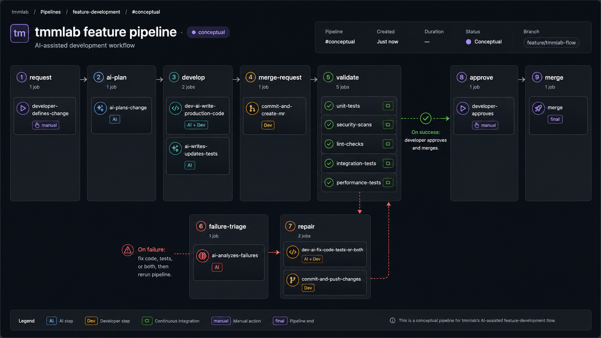

# Welcome!

🌱 Passionate about positively impacting and transforming people's lives through technology! 
🌳 Passion for understanding “the how” behind technology solutions  
🌲 Strong focus on “How to Achieve” 

---

## 🤝 Connect with Me 

  </a>
  &nbsp;&nbsp;&nbsp;&nbsp;
  <!-- Email contact -->
  <code>✉️ eng.miguelaz@gmail.com</code>

_Let's make the most of our time together!_  
_You're welcome to bring documents or questions to our meetings_

---

## TMM-LAB Innovation Ecosystem
https://tmm-lab.com/

    Estimated Launch: <kbd><time datetime="2026-07">Q3 2026</time></kbd>

 

---

## Development Doctrine

  

 

